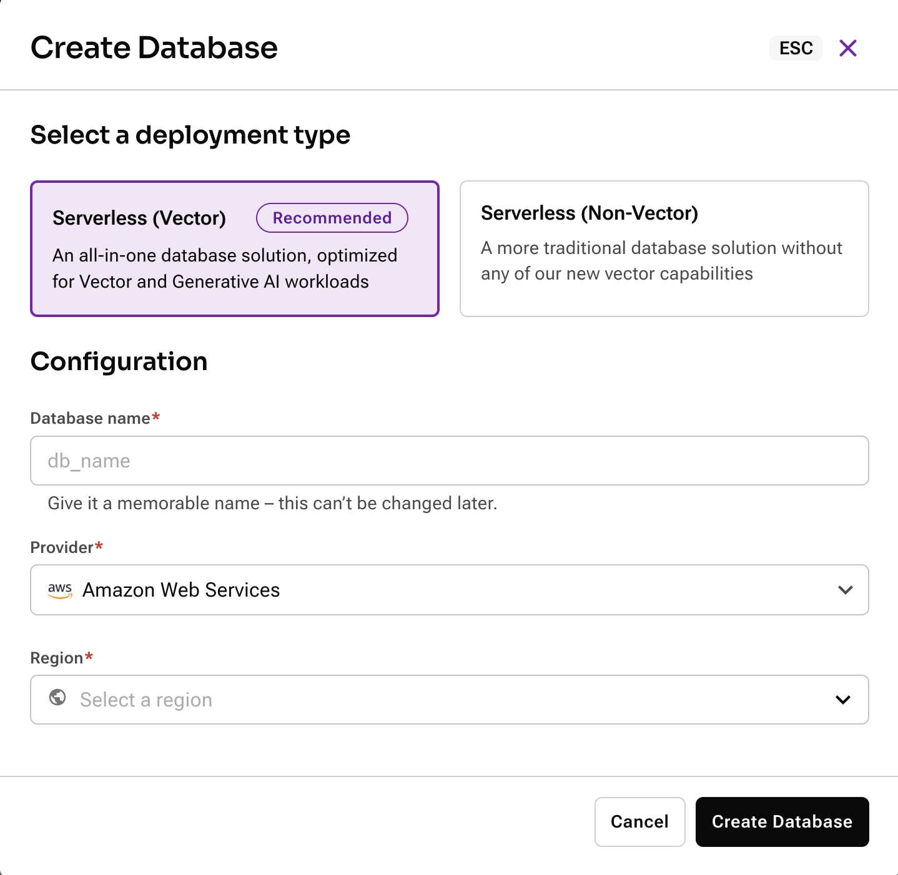
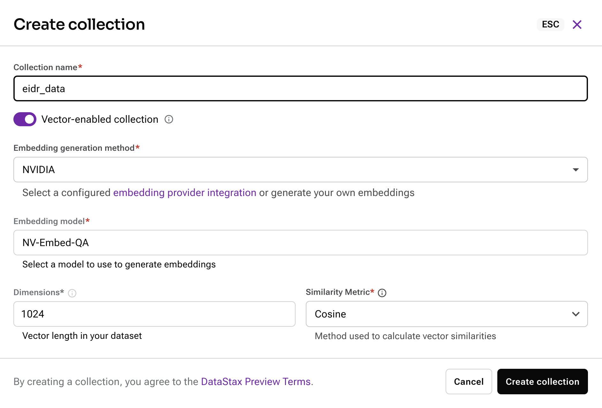
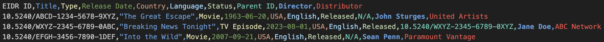
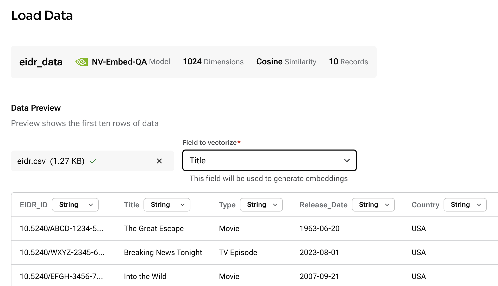
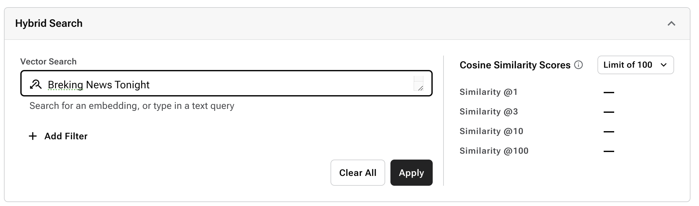
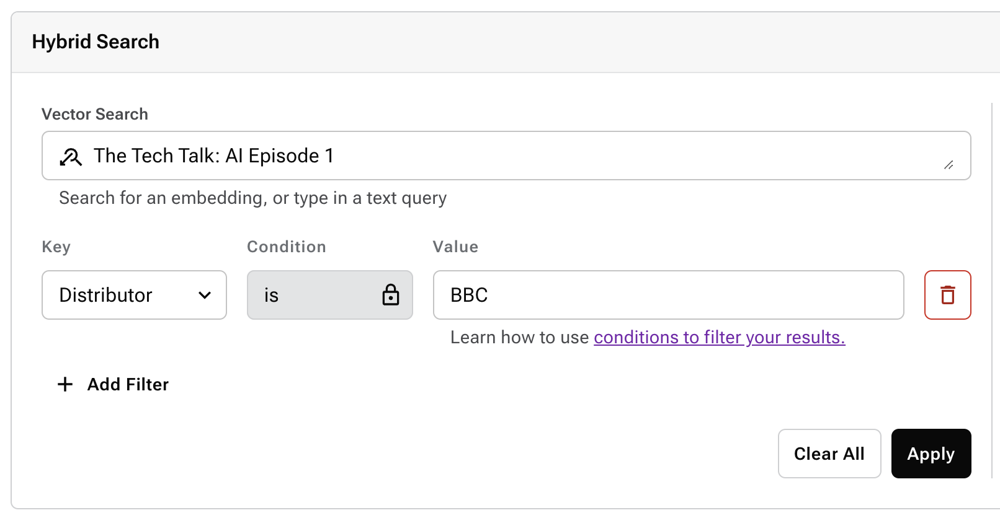

# EIDR Movie and Series data Matching
This repository shows how to use [DataStax](https://datastax.com) [Astra DB ](https://astra.datastax.com) to easily load EIDR data and run fuzzy matches on them using Vector Search.

> The Entertainment Identifier Registry (EIDR) is a unique identifier system for audiovisual content such as movies, TV shows, and digital videos. It provides a standardized, universal ID for each piece of content to ensure consistency across various platforms and databases, making it easier to catalog, distribute, and track media. EIDR IDs help companies and organizations manage digital rights, improve data accuracy, and streamline content management processes in the entertainment industry by eliminating duplication and confusion over different versions or formats of the same content.

Sometimes, however, it can be difficult to match the source of truth with information that is passed on by customers like streaming services as they use slightly different names or conventions.

This repository shows how to solve that problem by using a matching solution that is based on Vector Search.

> Vector search is a method of searching through data by comparing high-dimensional numerical representations, or “vectors,” of the content. Unlike traditional keyword-based search, vector search uses machine learning models to understand the semantic meaning of data, such as text, images, or audio. This approach allows for finding items that are conceptually similar rather than just exact matches, improving the relevance of search results in applications like recommendation systems, natural language processing, and personalized content delivery.

Have a look at this [Google Colab](https://colab.research.google.com/drive/19Tk1ZAdQmkdPlCZOvMaP-jqSf3FqWUa7) that shows a lot of the concepts.

## Loading the data

### Set up Astra DB
1. Navigate to [Astra DB](https://db.new)
2. Create a new database by clicking `Create Serverless Database`
3. Select the `Serverless (Vector)` option
4. Name the DB, select `AWS` and `us-east-2`!
5. And click `Create Database`


The database will provision in just a few minutes.

### Create a collection
In this example we'll be loading a `CSV` file and storing it into Astra DB as `JSON documents`.

In order to do so, and to enable `Semantic Search` using Vector Search, we have to create a collection.

1. Click on the database you just created and navigate to the tab `Data Explorer`
2. Click `Create Collection`
3. Name it as `eidr_data`
4. Now we have to select an `Embedding Model` that will generate the Vector Data. In this example we choose the `NVIDIA` model which is embedded into Astra.
5. Just keep the default and select `Cosine` as the `Similarity Metric`.
6. Click `Create Collection`.


It will take a few seconds to create the new collection.

### Load sample data
This repository contains a generated sample set of EIDR data as follows:


1. Click `Load Data`
2. In the new window, click `Select File` and open `eidr.csv`
3. Astra DB will sample the file automatically and select the right data types for the columns.
4. To enable the generation of embeddings using the NVIDIA service, select 'Title' as the field.
5. Click `Load Data`


The data will be loaded asynchrounously and will take a moment.

## Searching for data
In this step we'll search on the data (the source of thruth) using different variations of the orgiginal title.

For instance:
- A typo: `Breking News Tonight` instead of `Breaking News Tonight`
- A different convention: `The Tech Talk: AI Episode 1` instead of `The Tech Talk: AI Ep1`
- A different meaning: `Quick Recipes: Spaghetti` instead of `Quick Recipes: Pasta`

### Using the Astra DB UI
In this step we'll use the Astra DB UI to run some similarity searches.

1. Select your newly created collection
2. Type your search string in `Vector Search`
3. Click `Apply`



You can also run a Hybrid Search as such:



### Using a programmatic approach
In this step we'll use a programmatic way using Python to run the same searches.

1. Click `Connection Details`
2. Generate a Token by clicking on `Generate Token`. Be sure to keep the safely stored somewhere as it will disapear in the next step!
2. Install the Astra library

    `pip install --upgrade astrapy`
3. Copy and paste the code to a new file in your development environment. Make sure to update the token!

    ```python
    from astrapy import DataAPIClient

    # Initialize the client
    client = DataAPIClient("YOUR_TOKEN")
    db = client.get_database_by_api_endpoint(
      "https://3177f021-586c-418d-8df4-845360fe8583-us-east-2.apps.astra.datastax.com"
    )

    print(f"Connected to Astra DB: {db.list_collection_names()}")
    ```
4. Now run the file and see the connection happening

    `python astradb.py`

5. It's time to run the Vector Search, add the following to your file:

    ```python
    # Connect to the collection
    collection = db.get_collection("eidr_data")

    # Perform a vector search
    query = "Breking News Tonight"
    results = collection.find(
        sort={"$vectorize": query},
        limit=2,
        projection={"$vectorize": True},
        include_similarity=True,
    )
    print(f"\nVector search results for '{query}':")
    for document in results:
        print("    ", document)
    ```
6. And finally we'll run a Hybrid Search by adding the following to the file:

    ```python
    # Perform a hybrid search
    query = "The Tech Talk: AI Episode 1"
    results = collection.find(
        {"Distributor": "BBC"},
        sort={"$vectorize": query},
        limit=2,
        projection={"$vectorize": True},
        include_similarity=True,
    )
    print(f"\nHybrid search results for '{query}':")
    for document in results:
        print("    ", document)
    ```

